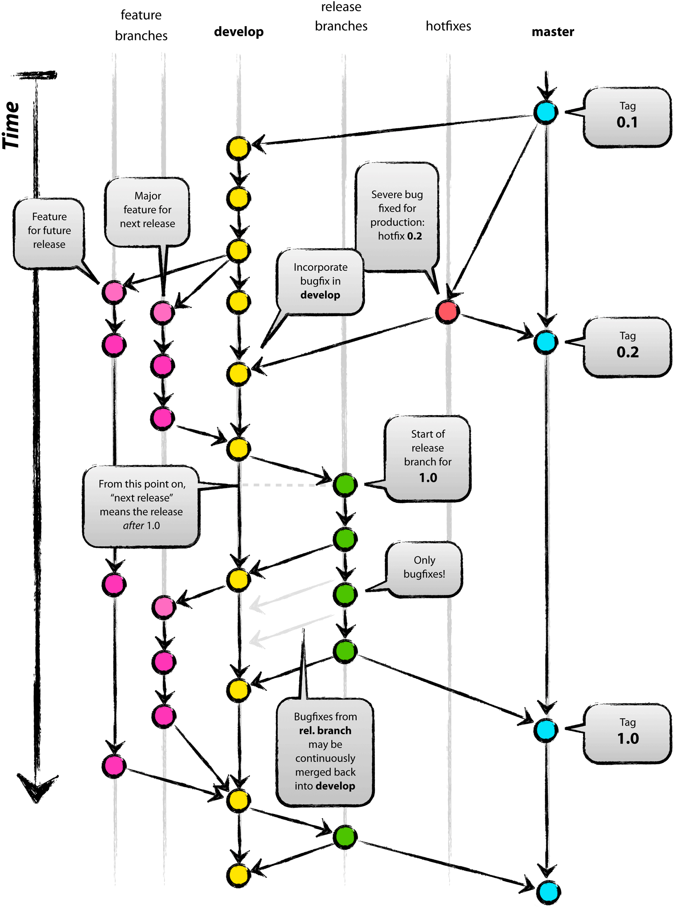

# Git Flow  

- [阮一峰:Git工作流程](http://www.ruanyifeng.com/blog/2015/12/git-workflow.html)
- [Git在团队中的最佳实践--如何正确使用GitFlow](https://www.cnblogs.com/cnblogsfans/p/5075073.html)
- 功能驱动 :(Feature-driven development，简称FDD）
	- 先有需求再有功能分支（feature branch）或者补丁分支（hotfix branch）。
	- 完成开发后，该分支就合并到主分支，然后被删除

## 特点 
* 主分支master `存放对外发布的版本,任何时候在这个分支拿到的，都是稳定的分布版`
* 开发分支develop `后者用于日常开发，存放最新的开发版`
* 三种短期分支
	* 功能分支（feature branch）
	* 补丁分支（hotfix branch）
	* 预发分支（release branch）
* 

## 常见分支

- Production 分支
	- 也就是我们经常使用的Master分支，这个分支最近发布到生产环境的代码，最近发布的Release， 这个分支只能从其他分支合并，不能在这个分支直接修改
	- **所有在Master分支上的Commit应该Tag**

- Develop 分支
	- 这个分支是我们是我们的主开发分支，包含所有要发布到下一个Release的代码，这个主要合并与其他分支，比如Feature分支
	
- Feature 分支
	- 这个分支主要是用来开发一个新的功能，一旦开发完成，我们合并回Develop分支进入下一个Release
	- **Feature分支做完后，必须合并回Develop分支**
- Release分支
	- 当你需要一个发布一个新Release的时候，我们**基于Develop分支创建一个Release分支**，完成Release后，我们合并到Master和Develop分支
	- 在这个Release分支上测试，修改Bug等
	- **一旦打了Release分支之后不要从Develop分支上合并新的改动到Release分支**
	- **发布Release分支时，合并Release到Master和Develop**
		- 同时在Master分支上打个Tag记住Release版本号
		- 然后可以删除Release分支了。 
- Hotfix分支
	- 当我们在Production发现新的Bug时候,**基于Master分支创建Hotfix** 
	- 完成Hotfix后，我们合并回Master和Develop分支，**所以Hotfix的改动会进入下一个Release**

 
 
 

### 有任何问题及时反馈 email 

>  `dragonli_52171@163.com` 
 
 